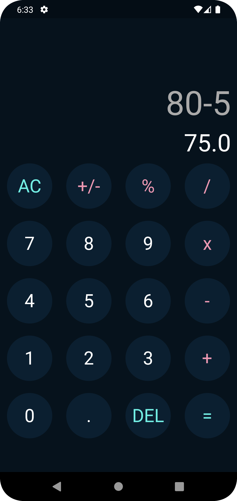

# 🧮 Calculator
Calculator é um aplicativo de calculadora elegante e fácil de usar desenvolvido com Flutter. Ele oferece uma interface de usuário moderna e pode realizar cálculos aritméticos básicos com facilidade.

# 🚀 Funcionalidades
- Adição: Realiza adições simples entre dois números.
- Subtração: Efetua subtrações entre dois números.
- Multiplicação: Realiza multiplicação de dois números.
- Divisão: Efetua a divisão entre dois números.
- Porcentagem: Calcula a porcentagem de um número.

# 📱 Capturas de Tela
<div style="text-align: center;">
  
</div>

# 🛠️ Como Utilizar
Para utilizar o Calculator, siga estas etapas:

```bash
Clone the Repository: git clone https://github.com/waneymartinsM/calculator.git
Navigate to the Project Directory: cd calculator
Install Dependencies: flutter pub get
Run the Project: flutter run
```

## 🤝 Contribuições
Contribuições são bem-vindas! Se você deseja contribuir para este projeto, siga estas etapas:

```bash
Faça um fork do projeto.
Crie uma nova branch com a sua feature: git checkout -b feature/nova-feature
Realize as alterações necessárias e faça commit das mudanças: git commit -m 'Adicione uma nova feature'
Faça push para a branch: git push origin feature/nova-feature
Abra um pull request para revisão.
```

## ❓ Dúvidas e Sugestões
Se você tiver alguma dúvida ou sugestão sobre o Modern Calculator, sinta-se à vontade para abrir uma issue. Estamos sempre abertos a feedbacks e melhorias!
